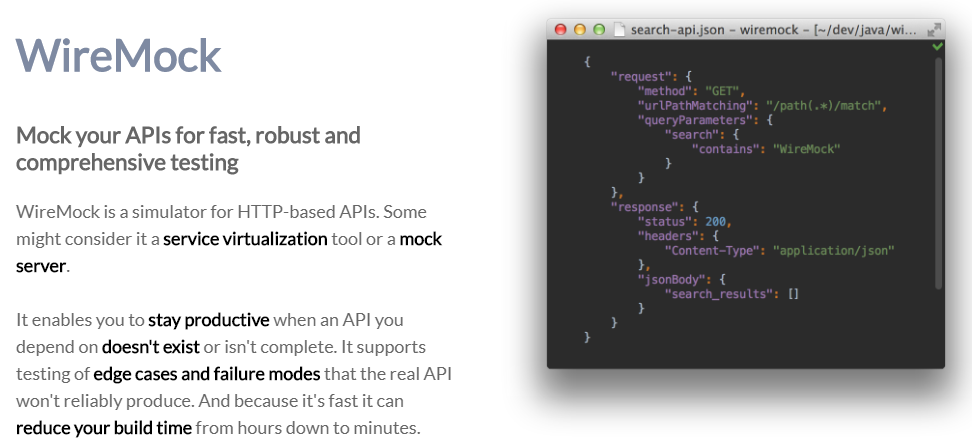
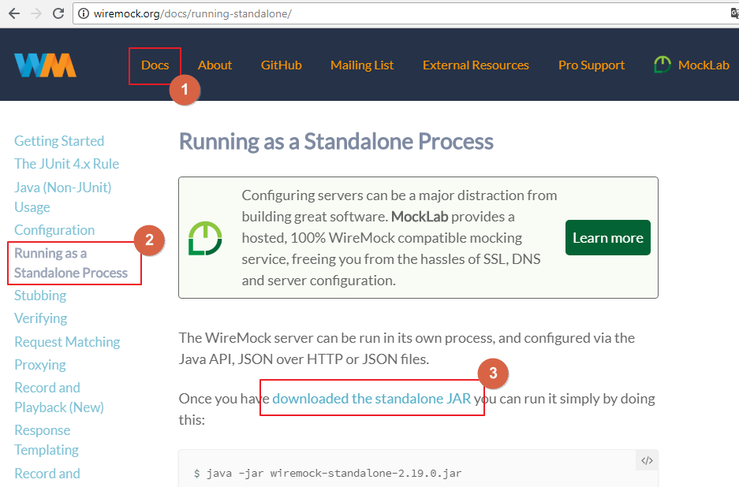

# java-sample-wiremock

声明：本实例用于个人学习参考。所有内容均参考至网络，由本人手动敲（抄）写。请勿用于商业途径。

## 一、什么是wiremock

**wiremock**是一个server，专门用来模拟响应各式各样的http请求。



## 二、如何获取wiremock

1. wiremock官网

   ```
   http://wiremock.org/
   ```

2. 下载

   

## 三、运行wiremock

```
java -jar wiremock-standalone-2.19.0.jar --port 8060
```

## 四、构建JAVA工程

### （一）创建一个Maven父工程

1. 新建一个Other项目；

   

2. 选择Maven Project；

   

3. 按下图配置创建工程；

   

   

4. 添加如下依赖；

   ``` xml
   <dependencyManagement>
       <dependencies>
           <dependency>
               <groupId>io.spring.platform</groupId>
               <artifactId>platform-bom</artifactId>
               <version>Brussels-SR13</version>
               <type>pom</type>
               <scope>import</scope>
           </dependency>
       </dependencies>
   </dependencyManagement>
   
   <build>
       <plugins>
           <plugin>
               <groupId>org.apache.maven.plugins</groupId>
               <artifactId>maven-compiler-plugin</artifactId>
               <version>2.3.2</version>
               <configuration>
                   <source>1.8</source>
                   <target>1.8</target>
                   <encoding>UTF-8</encoding>
               </configuration>
           </plugin>
       </plugins>
   </build>
   ```

### （二） 创建子工程

1. 新建一个Other项目；

   

2. 选择Maven Module；

   

3. 按下图创建工程；

   

   

4. 在子工程中引入依赖

```xml
<!-- https://mvnrepository.com/artifact/com.github.tomakehurst/wiremock -->
<dependency>
    <groupId>com.github.tomakehurst</groupId>
    <artifactId>wiremock</artifactId>
    <version>2.19.0</version>
</dependency>
```

5. 创建com.sample.MockServer类；


### （三）建立一个简单的wiremock响应

1. 在MockServer的静态方法中指定服务器位置；


2. 将WireMock的静态方法添加到Eclipse的Favorites；（详见《如何将静态方法加入到Favorites.md》）

**路径：**

```
C:\Lei\_DEV\Workspace\Sample\eclipse-sample-favorites
```


3. 伪造一个测试桩；


4. 运行这个main方法，同时在浏览器中访问下面地址，可以看到withBody中的内容被现实到浏览器上；

```http
http://localhost:8060/order/1
```


### （四）用wiremock返回模板内容

1. 新建一个文件夹，并创建一个01.txt文件；

   **文件夹路径：**

   ```
   src/main/resources/mock/response
   ```

   **01.txt文件内容：**

   ```
   {
   	"id": 2,
   	"type": "A"
   }
   ```

2. 在这个子工程中添加下面依赖；

   ```xml
   <dependency>
       <groupId>commons-io</groupId>
       <artifactId>commons-io</artifactId>
   </dependency>
   <dependency>
       <groupId>org.springframework.boot</groupId>
       <artifactId>spring-boot-starter-web</artifactId>
   </dependency>
   <dependency>
       <groupId>org.apache.httpcomponents</groupId>
       <artifactId>httpcore</artifactId>
   </dependency>
   <dependency>
       <groupId>org.apache.httpcomponents</groupId>
       <artifactId>httpclient</artifactId>
   </dependency>
   ```

3. 用下面方法可以返回模板文件；

   

4. 运行这个main方法在浏览器访问下面地址，就可以的到模板文件的内容。

   ```http
   http://localhost:8060/order/3
   ```


